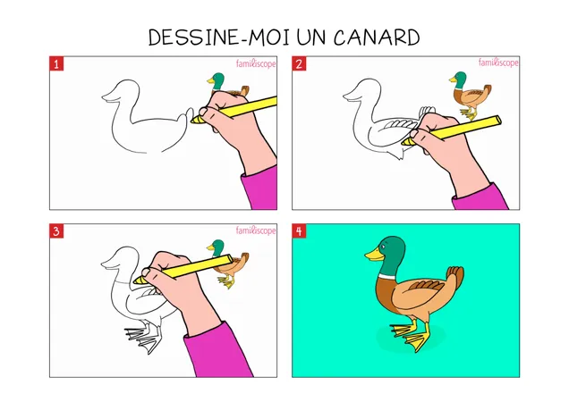

<html lang="fr">
  <head>
    <h1>Canards</h1>
  </head>
  <body>
    <header>
      
Bienvenue sur mon site sur les canards

    </header>
  
voici ci-contre trois faits à connaître sur les canards que se site aborde :

	  <li>Présentation</li>
	  <li>Habitats</li>
	  <li>Tutoriel de dessin</li>
    <h2>présentation</h2>
    
Les canards sont des oiseaux ansériformes , au cou court , au large bec jaune aplati , aux très courtes pattes palmées et aux longues ailes pointues .

    
voici une image de canard .

    
    <h3>Habitats</h3>
    
les canards vivent dans une majeure partie des pays du monde . Ils sont présent dans des environnements humides comme des lacs ou des rivières . Car ils ont besoin d'eau pour se nourir et se reproduire , toutefois ils peuvent se nourir sur la terre ferme .

    
 voici une carte qui représente les régions dans lesquels sont présent des canards .

    
    <h4>Tutoriel de dessin</h4>
	  
Se tutoriel vous aprendra à dessiner un canard en trois étapes simples .

  	  
Pour commencer il faut tracer une forme ressemblant à un point d'interrogation pour faire la tête du canard, à gauche de ce trait il faudra dessiner un bec, il faudra ensuite tracer une courbe en dessous pour faire son cou et dessiner un trait pour faire son dos , a la fin de ce trait il faudra dessiner des ovales pour faire sa queue. Et normalement votre dessin devrait être complet , libre à vou de rajouter des détails . 

	  
 Voici une ilustration des étapes à suivre . 

	  
  
